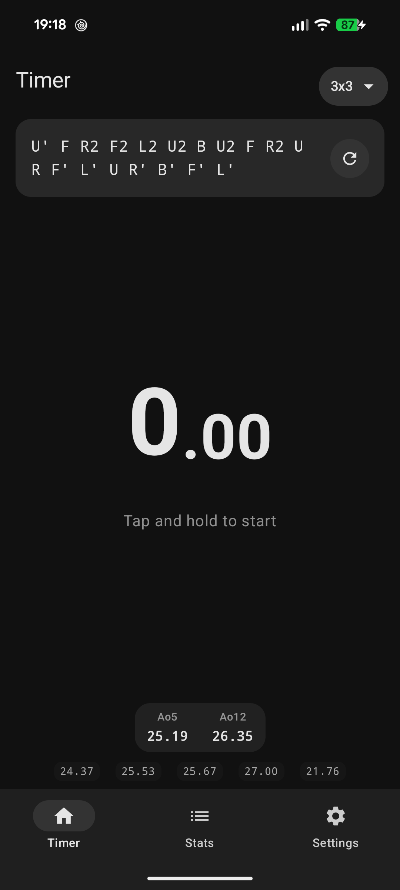
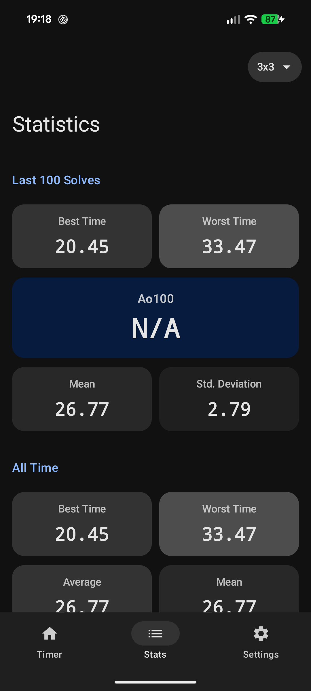
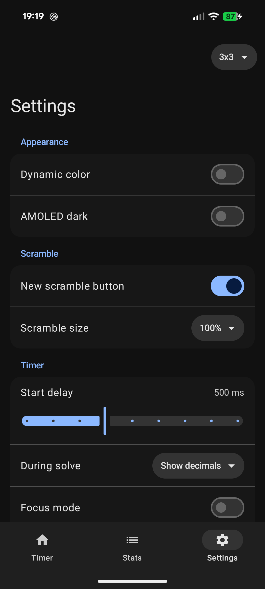

# Cubing timer

A simple Android cubing timer focused on a fast, clean solving flow.

## Features
- Timer
- WCA scramble generator (2x2, 3x3, 4x4, 5x5, Megaminx, Pyraminx)
- Statistics and history
- Customizable timer, scramble, display, and haptic settings

## Screenshots

  
  
  

